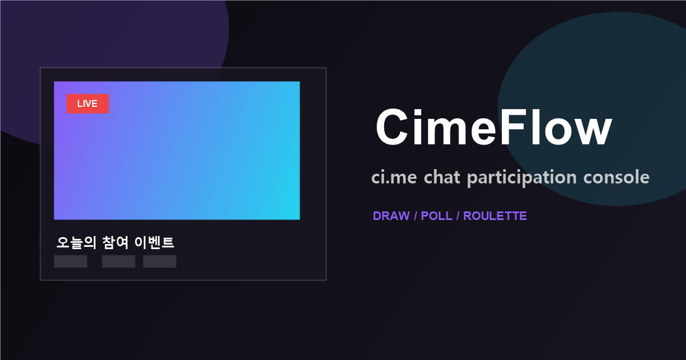

# CimeFlow

CimeFlow는 ci.me 스트리밍을 위한 오픈소스 실시간 참여 관리 콘솔입니다. 채팅 활동을 실시간 시청자 추첨, 숫자 투표, 후원 가중치 투표, 룰렛 등 방송 송출 시 즉시 활용 가능한 인터랙티브 도구로 변환해 줍니다.

이 프로젝트는 크게 두 개의 프로세스로 구성되어 있습니다:

- **UI 서버**: Next.js 기반의 웹 인터페이스를 제공합니다.
- **Relay 서버**: ci.me 채널 조회, IVS 채팅 WebSocket 허브 관리, 메시지 정규화, 배치 처리(Batching) 및 클라이언트 팬아웃(Fan-out)을 전담합니다.



> **Note**: CimeFlow는 독립적인 서드파티 프로젝트입니다. ci.me에서 공식적으로 운영하지 않으며, ci.me의 로고, 마스코트 등 브랜드 자산을 포함하지 않습니다.

## 주요 기능

- **실시간 시청자 추첨**: 채팅 참여자 중 무작위 당첨자 선정
- **숫자 기반 투표**: 중복 투표 방지 로직이 포함된 명령어 투표
- **후원 가중치 투표**: 후원 금액(도네이션)에 따른 차등 투표권 부여
- **대화형 룰렛**: 수동 항목 추가 또는 투표 결과 연동 지원
- **최적화된 리스트**: 대규모 시청자 접속 시에도 부드러운 스크롤(가상화) 지원
- **세션 제어**: 타이머 기반의 참여 종료 및 자동 세션 관리
- **테마 시스템**: 라이트/다크 모드 및 커스텀 테마 지원

## 활용 사례

- 라이브 방송 중 이벤트 당첨자 즉석 추첨
- 시청자 참여형 밸런스 게임 및 번호 선택 투표
- 후원 금액 비례 당첨 확률을 적용한 이벤트 진행
- 투표로 결정된 후보지나 벌칙을 룰렛으로 최종 결정
- 활발한 채팅 환경에서도 성능 저하 없는 참여자 명단 관리

## 아키텍처

```text
브라우저 UI <-> CimeFlow Relay <-> ChannelHub <-> ci.me IVS Chat
    |              |              |
    |              |              +-> 채널별 싱글 업스트림 커넥션
    |              |              +-> 100ms 배칭 처리 및 부하 최적화
    |              |              +-> 다중 클라이언트 팬아웃
    |              |
    |              +-> ci.me 채널 조회 및 메타데이터 동기화
    |              +-> 레이트 리밋(Rate Limit) 및 프로메테우스 메트릭
    |
    +-> Next.js UI 서버 (SSR/CSR)
```

Relay 서버는 활성화된 채널마다 단 하나의 업스트림 커넥션을 유지하며, 연결된 모든 클라이언트에게 압축된 배치 데이터를 전파합니다. 이를 통해 다수의 운영자가 동시에 접속하더라도 ci.me 서버에 가해지는 중복 커넥션 부하를 원천 차단합니다.

## 사전 준비 사항

- Node.js 20.9 (LTS) 이상
- npm 10 이상

## 시작 가이드 (Getting Started)

```bash
# 저장소 복제 및 의존성 설치
git clone https://github.com/yeonyua07/CimeFlow.git
cd CimeFlow
npm ci  # npm install 대신 npm ci를 권장합니다 (package-lock.json 기반 재현 가능 설치)

# 환경 설정 (필요시 .env.local 수정)
cp .env.example .env.local
```

개발 환경에서는 두 프로세스를 각각 실행해야 합니다:

```bash
# Terminal 1: Relay 서버 실행
npm run dev:relay

# Terminal 2: UI 서버 실행
npm run dev:ui
```

브라우저에서 `http://localhost:3000`에 접속하세요. Relay 서버는 기본적으로 `3001` 포트를 사용합니다.

**Windows** 사용자를 위한 간편 실행 파일도 제공됩니다 (Windows 전용):
```bat
start-dev.bat
```

Linux/macOS에서는 위의 터미널 명령어(`npm run dev:relay` / `npm run dev:ui`)를 직접 사용하세요.

## Docker 배포

Docker Compose를 사용하여 UI, Relay, Redis를 한 번에 실행할 수 있습니다:

```bash
docker compose up -d --build
```

기본 설정은 단일 서버 자체 호스팅(Self-hosting)에 최적화되어 있습니다. 대규모 트래픽 처리를 위한 인스턴스 클러스터링 구성 시에는 리버스 프록시 설정을 추가로 검토하세요.

수동으로 도커를 실행하려는 경우:

> **주의**: CimeFlow는 UI 서버와 Relay 서버 두 프로세스로 구성됩니다.  
> 수동 실행 시에는 **두 도커를 모두** 기동해야 정상 동작합니다.

```bash
docker build -t cime-flow .
# Relay 서버 (먼저 실행)
docker run -d --name cime-flow-relay -p 3001:3001 --env-file .env.local cime-flow npm run start:relay
# UI 서버
docker run -d --name cime-flow-ui -p 3000:3000 --env-file .env.local cime-flow npm run start:ui
```

## 프로덕션 환경 구축

빌드 및 서버 시작:
```bash
npm run build
npm run start:relay
npm run start:ui
```

**PM2**를 사용한 안정적인 프로세스 관리:
```bash
npm install -g pm2
npm run build
pm2 start ecosystem.config.js
```

주요 PM2 관리 명령어:
```bash
pm2 status                  # 상태 확인
pm2 logs cime-flow-relay    # 릴레이 서버 로그 모니터링
pm2 restart all             # 전체 재시작
```

## 환경 변수 설정 (Environment Variables)

| 변수명 | 필수 여부 | 기본값 | 설명 |
| --- | --- | --- | --- |
| `PORT` | No | `3000` | UI 서버 포트 |
| `RELAY_PORT` | No | `3001` | Relay 서버 포트 |
| `INSTANCE_ID` | No | generated | 로그 및 Redis 식별용 인스턴스 ID |
| `MAX_SESSIONS` | No | `1000` | 프로세스당 최대 동시 접속 세션 수 |
| `MAX_CHANNEL_HUBS` | No | `300` | 프로세스당 최대 활성 채널 수 |
| `MAX_CLIENTS_PER_CHANNEL` | No | `100` | 채널당 최대 브라우저 클라이언트 수 |
| `MAX_WS_PER_IP` | No | `50` | 동일 IP당 최대 WebSocket 연결 수 |
| `CORS_ORIGIN` | No | `*` | 허용된 브라우저 오리진 (운영 시 설정 권장) |
| `TRUST_PROXY` | No | `false` | 리버스 프록시(`X-Forwarded-For`) 신뢰 설정 |
| `REDIS_URL` | No | empty | 분산 레이트 리밋 및 하트비트용 Redis 주소 |
| `METRICS_TOKEN` | No | empty | 메트릭 엔드포인트 보호용 Bearer 토큰 |
| `ADMIN_TOKEN` | No | empty | 원격 드레인(`/api/drain`) 실행용 토큰 |
| `LOG_IP_MODE` | No | `hash` | IP 로깅 방식 (`hash`, `none`, `raw`) |

`NEXT_PUBLIC_CIME_RELAY_HTTP_URL` 및 `NEXT_PUBLIC_CIME_RELAY_WS_URL`은 브라우저 사이드에서 Relay에 접속하기 위한 경로입니다. 도메인이 다른 프로덕션 환경에서는 반드시 빌드 전에 설정되어야 합니다.

## 모니터링 및 상태 확인 (Operations)

Relay 상태 및 헬스 체크:
```bash
curl http://localhost:3001/api/health   # 기본 상태 정보 (JSON)
curl http://localhost:3001/api/ready    # 준비 상태 (Liveness/Readiness)
curl http://localhost:3001/metrics      # 프로메테우스 지표 (Prometheus)
```

UI 상태 확인:
```bash
curl http://localhost:3000/api/health
```

상세 운영 매뉴얼은 다음 문서들을 참고하세요:
- [운영 가이드](docs/OPERATIONS.md)
- [개인정보 처리 지침 (Privacy Guide)](docs/PRIVACY.md)
- [릴리스 및 롤백 가이드 (Release/Rollback)](docs/RELEASE.md)

Relay 서버는 구조화된 **JSON 로그**를 출력하므로 ELK 스택이나 CloudWatch 등과의 연동이 용이합니다.

## 스케일링 (Scaling)

CimeFlow Relay는 확장 가능한 채널 허브 구조를 가집니다:

- **연결 최적화**: 채널당 1개의 업스트림 연결만 유지하여 대역폭 절약
- **분산 환경 지원**: Redis 연동 시 여러 대의 Relay 인스턴스 간 레이트 리밋 및 세션 수치 동기화
- **로드 밸런싱**: Nginx의 Consistent Hashing 설정을 통해 특정 채널 요청을 특정 인스턴스로 고정(Sticky Session) 가능

권장 배포 아키텍처:
```text
L4/L7 로드 밸런서 (Nginx/Caddy)
├── UI Cluster (Next.js)
└── Relay Pool (Node.js)
    └── Shared Redis (Rate limit/Metadata)
```

## 프로젝트 구조

```text
cime-flow/
├── app/                    # Next.js App Router (UI 화면)
├── lib/                    # 공통 비즈니스 로직 및 상태 관리 (Zustand)
├── server.js               # UI 서버 엔트리
├── relay-server.js         # Relay 서버 엔트리 (WebSocket/API)
├── ecosystem.config.js     # PM2 클러스터 설정
└── docs/                   # 운영 및 기술 문서
```

## 기술 스택

- **Frontend**: Next.js 16 (App Router), React 18
- **State Management**: Zustand
- **Styling**: Styled-components
- **Server**: Node.js (Standard HTTP/WebSocket)
- **Database/Cache**: Redis (Session Metadata & Rate Limiting)
- **Monitoring**: Prometheus, JSON Structured Logging

## 기여 가이드 (Contributing)

프로젝트 기여를 환영합니다! PR을 제출하기 전에 [CONTRIBUTING.md](CONTRIBUTING.md)를 반드시 확인해 주세요.


## 라이선스

MIT License
